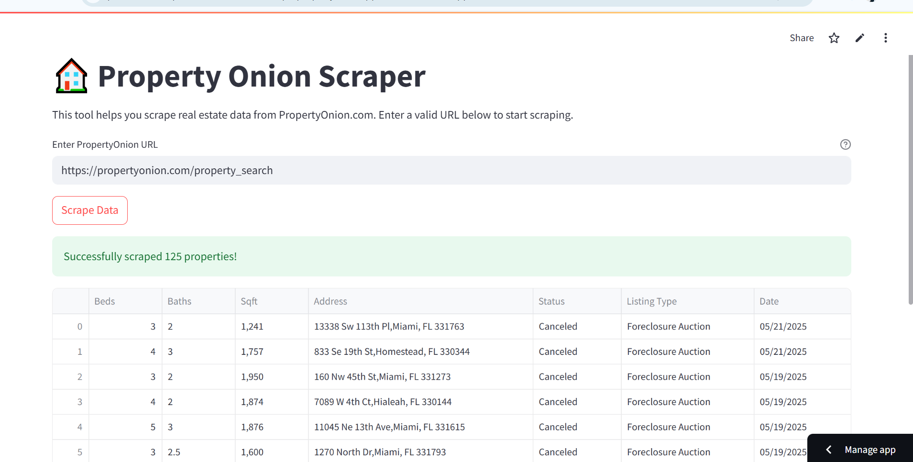

# 🏠 Property Onion Real Estate Scraper | Meta SciFor Internship Project

Welcome to my internship project under **Meta SciFor Technologies**!  
This is a real estate data scraping tool that extracts property listings from **PropertyOnion.com** and presents them in a clean, interactive **Streamlit** web application.

---

## 📌 Project Overview

**Property Onion Scraper** is a Python-based web scraping application designed to fetch and organize real estate property details from **PropertyOnion.com**. The app uses **Selenium WebDriver** and **BeautifulSoup** for scraping and parsing, and presents the extracted data through an interactive **Streamlit** interface.

---

## 📊 Features

- ✅ Scrapes property details:  
  - 🛏️ Beds  
  - 🚿 Baths  
  - 📐 Square Footage  
  - 📍 Address  
  - 📑 Status  
  - 📃 Listing Type  
  - 📅 Date  

- ✅ Clean data validation to filter out incomplete listings  
- ✅ Download extracted data as a **CSV file**  
- ✅ Real-time status feedback and error handling  
- ✅ Secure and responsive Streamlit UI  
- ✅ URL validation for safe scraping

---

## 🚀 Tech Stack

- `Python`
- `Pandas`
- `BeautifulSoup`
- `Selenium`
- `WebDriver Manager`
- `Streamlit`
- `CSV`

---

## 📸 App Snapshots


 


---

## 📂 Project Structure

```

├── 📄 app.py                 # Streamlit app for scraping PropertyOnion listings
├── 📄 requirements.txt       # Python dependencies
├── 📄 README.md              # Project documentation
└── 📄 LICENSE                # License file (restricts reuse/modification)
```

---

## 📚 What I Learned

✅ Hands-on web scraping techniques using **Selenium** and **BeautifulSoup**  
✅ Automating browser interactions with **headless Chrome WebDriver**  
✅ Designing interactive and user-friendly apps with **Streamlit**  
✅ Validating, structuring, and exporting real estate data for practical use  

---

## 📌 About the Internship

This project was developed as part of my **Data Science Internship** at **Meta SciFor Technologies**, focusing on real estate data acquisition and interactive data tool development.

---

## 📞 Connect with Me

- [LinkedIn](https://www.linkedin.com/in/pritesh-ramani/)


---

## ✨ Credits

Built with 💙 as part of my **Data Science Internship at Meta Scifor Technologies**.

---

## 📑 License

This project is licensed under the MIT License. 